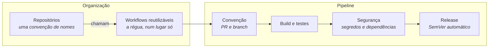

# Fernando Moretes

**Arquitetura de soluções · AWS · IA · Engenharia de plataforma**

Uma convenção, uma pipeline, um lugar.

---

## Por que uma organização

O portfólio cresceu além do que uma conta pessoal governa bem. Repositórios
acumulados ao longo de anos, cada um com o seu jeito de nomear, de testar e de
versionar — quando isso passa de algumas dezenas, o custo deixa de ser escrever
código e passa a ser encontrar as coisas e confiar no que está lá.

Houve também um limite técnico. Conta pessoal do GitHub **não tem runner de
nível de conta**: a API expõe runners por repositório e por organização, e o
endpoint de usuário não existe. Automação de CI própria numa conta pessoal
significaria repetir a mesma configuração repositório a repositório.

Mover para uma organização resolveu os dois de uma vez, e forçou a padronização
que estava atrasada.

---

## Como está montado

Cada repositório carrega um chamador de poucas linhas apontando para os
workflows reutilizáveis. Corrigir a régua é mudar **um arquivo** — a correção
alcança todos no push seguinte, sem migração e sem varredura.

---

## A convenção de nomes

Um nome deveria responder três perguntas antes de alguém abrir o código: o que
é, para que serve e se ainda vale mexer. Oito prefixos dão conta:

| Prefixo | O que é |
|---|---|
| `app-` | Aplicação com deploy e usuário final |
| `svc-` | Serviço ou API, sem interface própria |
| `ref-` | Arquitetura de referência e material técnico |
| `tool-` | Utilitário de linha de comando |
| `infra-` | Infraestrutura como código e plataforma |
| `lib-` | Biblioteca consumida por outros projetos |
| `dot-` | Configuração de ambiente |
| `lab-` | Experimento e prova de conceito |

Um repositório é `lab-` até provar que é outra coisa. Promover é barato;
descobrir tarde que um `app-` nunca passou de experimento é caro.

---

## O que a pipeline verifica

| Etapa | O que olha |
|---|---|
| **Convenção** | Título do PR em Conventional Commits, nome do branch, tamanho da mudança |
| **Build** | Stack detectada pelos manifestos do próprio repositório |
| **Segurança** | Segredos no histórico e vulnerabilidade em dependência |
| **Release** | Versão calculada dos commits, com changelog |

**Só segredo vazado barra o merge.** Uma pipeline que barra tudo é uma pipeline
que se aprende a contornar. Vulnerabilidade em dependência entra numa fila e é
priorizada; segredo no histórico não espera fila, porque a credencial já vazou
no instante do push — e removê-la do histórico não a torna válida de novo.

A versão sai do commit: `fix:` sobe o patch, `feat:` o minor, `feat!:` o major.
Ninguém escreve número de versão à mão, então a régua é a mesma sempre.

---

## Público e privado

O que está aberto aqui é o que tem valor fora daqui: arquitetura de referência,
ferramenta reutilizável, material técnico. Trabalho de cliente e projeto em
andamento seguem fechados — não por qualidade, mas porque servem a um contexto
que não é o de quem passa por aqui.

---

## Em destaque

| Repositório | O que é | Stack |
|---|---|---|
| [`app-mcp-aws-solution-architect`](https://github.com/fernando-moretes/app-mcp-aws-solution-architect) | Bilingual MCP server and AWS solution architecture assistant for service discovery, Well-Archit | Python |
| [`app-aws-event-driven-finops-platform`](https://github.com/fernando-moretes/app-aws-event-driven-finops-platform) | Bilingual event-driven AWS banking platform with FinOps-aware service selection, security, obse | HTML · ⭐ 1 |
| [`app-bedrock-agent-starter`](https://github.com/fernando-moretes/app-bedrock-agent-starter) | Bilingual Amazon Bedrock agent starter with Lambda tools, Terraform, evaluations, docs and DevS | Python |
| [`app-aws-ai-reference-architectures`](https://github.com/fernando-moretes/app-aws-ai-reference-architectures) | Bilingual AWS AI reference architecture portfolio with Bedrock, RAG, MLOps, Terraform, Well-Arc | HCL |
| [`ref-finops-architect-toolkit`](https://github.com/fernando-moretes/ref-finops-architect-toolkit) | AWS FinOps toolkit: RI vs On-Demand, S3 storage class optimizer, Lambda cost estimator, tagging | TypeScript |
| [`app-aws-agentic-ai-reference-architecture`](https://github.com/fernando-moretes/app-aws-agentic-ai-reference-architecture) | Bilingual AWS agentic AI reference architecture with Bedrock, MCP tools, guardrails, observabil | HTML · ⭐ 1 |
| [`ref-aws-architecture-studio`](https://github.com/fernando-moretes/ref-aws-architecture-studio) | AWS Architecture Studio: ADR wizard with live preview, Mermaid diagram builder, reference patte | TypeScript |
| [`ref-aws-pattern-library`](https://github.com/fernando-moretes/ref-aws-pattern-library) | A curated catalog of 22+ AWS reference architectures with diagrams, ADRs, Well-Architected poin | TypeScript |
| [`ref-adr-decision-platform`](https://github.com/fernando-moretes/ref-adr-decision-platform) | Web platform to author, list and version ADRs and RFCs with MADR, Nygard and Y-statement templa | TypeScript |
| [`ref-architecture-diagrams-library`](https://github.com/fernando-moretes/ref-architecture-diagrams-library) | Diagrams as code for AWS, C4, BPMN, event-driven, sequence and state — reproducible and reviewa | TypeScript |
| [`ref-architect-frameworks-hub`](https://github.com/fernando-moretes/ref-architect-frameworks-hub) | Reference hub for AWS Well-Architected, TOGAF, C4, ArchiMate, DDD, 12-Factor and Cynefin. | TypeScript · ⭐ 1 |
| [`app-solution-architecture-mcp-toolkit`](https://github.com/fernando-moretes/app-solution-architecture-mcp-toolkit) | Bilingual MCP toolkit for ADRs, threat modeling, Well-Architected review and governed AI archit | HTML · ⭐ 1 |

<b>Ver os demais repositórios públicos</b>

| Repositório | O que é | Stack |
|---|---|---|
| [`tool-google-terminal-search`](https://github.com/fernando-moretes/tool-google-terminal-search) | CLI utility for Google search from the terminal, maintained as part of Fernando Moretes public  | Shell |
| [`ref-rs-visao-real`](https://github.com/fernando-moretes/ref-rs-visao-real) | Public Fernando Moretes repository connected to the broader architecture and engineering portfo | Python · ⭐ 5 |
| [`tool-m5cardputer-sshclient`](https://github.com/fernando-moretes/tool-m5cardputer-sshclient) | M5Cardputer SSH client experiment for embedded, IoT and developer tooling portfolio work. | C++ · ⭐ 67 |
| [`dot-homebrew-google-terminal-search`](https://github.com/fernando-moretes/dot-homebrew-google-terminal-search) | Homebrew distribution repository for google-terminal-search, part of Fernando Moretes public to | Ruby · ⭐ 1 |
| [`dot-setup-macos-developer`](https://github.com/fernando-moretes/dot-setup-macos-developer) | macOS developer workstation setup automation for repeatable engineering environments. | Shell · ⭐ 4 |
| [`ref-sa-daily-toolkit`](https://github.com/fernando-moretes/ref-sa-daily-toolkit) | Daily skills, scripts and templates for Solution Architects: ADRs, Well-Architected, threat mod | TypeScript |
| [`app-queue-advisor-pricing`](https://github.com/fernando-moretes/app-queue-advisor-pricing) | Queue Advisor pricing app published under moretes.com with public GitHub documentation. | TypeScript · ⭐ 1 |
| [`platform-workflows`](https://github.com/fernando-moretes/platform-workflows) | Workflows reutilizaveis das pipelines | — |
| [`app-dailyfocus`](https://github.com/fernando-moretes/app-dailyfocus) | DailyFocus productivity app published under moretes.com with public GitHub documentation. | TypeScript |

---

**TypeScript · Python · HTML · Shell · Ruby · C++**

[fernando.moretes.com](https://fernando.moretes.com) · [LinkedIn](https://www.linkedin.com/in/fernandofatech/)

Índice gerado automaticamente · 09/2026

