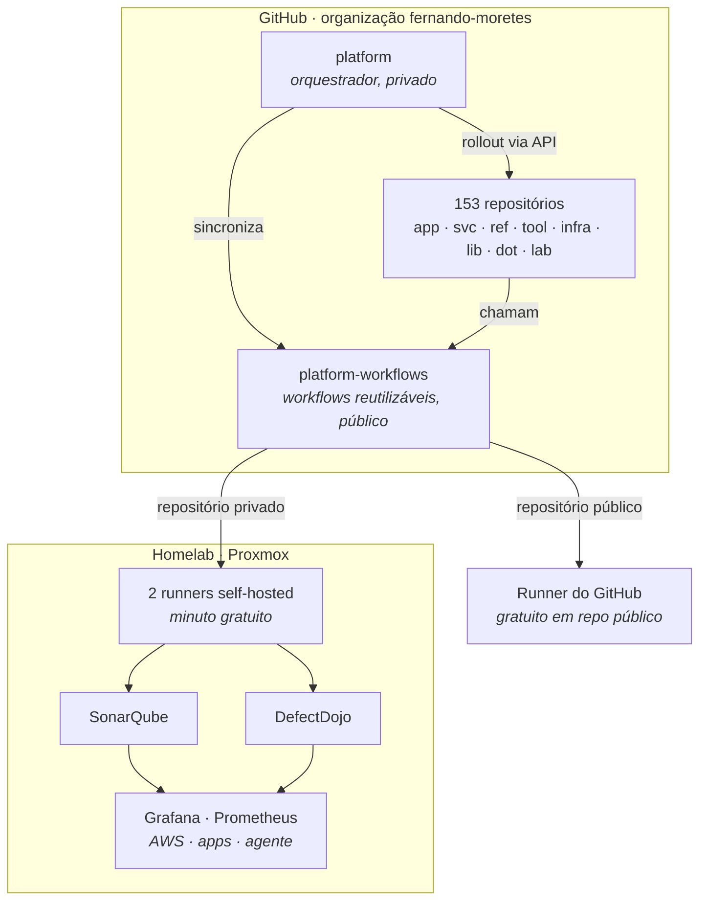

# Fernando Moretes

**Arquitetura de soluções · AWS · IA · DevSecOps**

153 repositórios sob uma convenção só, uma pipeline só e observabilidade própria.

---

## Por que esta organização existe

Estes repositórios viviam numa conta pessoal. Foram movidos por um motivo
técnico específico: **conta pessoal do GitHub não tem runner de nível de
conta**. A API só expõe `/repos/{owner}/{repo}/actions/runners` e
`/orgs/{org}/...` — o endpoint de usuário responde 404.

Enquanto tudo vivia numa conta pessoal, CI em runner próprio exigiria um
container por repositório. Com a organização, **dois runners atendem os
153**.

A mudança levou junto uma padronização que estava atrasada: taxonomia de nomes,
pipeline única, versionamento automático e um catálogo que se atualiza sozinho.

---

## Como está montado

**O runner depende da visibilidade, e não é preferência — são dois limites se
encontrando.** Repositório público tem minuto gratuito e ilimitado no runner do
GitHub, e não pode usar o self-hosted: qualquer PR de qualquer pessoa passaria a
executar código na rede de casa. Repositório privado é o oposto — minuto do
GitHub sai de uma cota mensal, o do self-hosted não sai de lugar nenhum.

Como SonarQube e DefectDojo vivem na LAN, análise de qualidade e gestão de
vulnerabilidade rodam só nos privados. Nos públicos esses jobs são pulados, em
vez de falharem por timeout a cada push.

---

## A pipeline

Cada repositório tem um chamador de poucas linhas apontando para
[`platform-workflows`](https://github.com/fernando-moretes/platform-workflows). Corrigir a
régua é mudar um arquivo — a correção alcança todos no push seguinte.

| Etapa | O que verifica |
|---|---|
| **pr-lint** | Título em Conventional Commits, nome do branch, tamanho do PR |
| **ci** | Node, Python ou genérico, escolhido pelos manifestos do repositório |
| **security** | gitleaks, trivy, SonarQube, envio ao DefectDojo |
| **release** | Calcula SemVer dos commits, cria a tag e o changelog |

**Só segredo vazado barra o merge.** Uma pipeline que barra tudo é uma pipeline
que se aprende a contornar; vulnerabilidade em dependência entra na fila e é
priorizada, enquanto segredo no histórico não espera fila — a credencial já
vazou no instante do push.

A versão sai do commit: `fix:` sobe o patch, `feat:` o minor, `feat!:` o major.
Ninguém escreve número de versão à mão.

---

## A convenção de nomes

Um nome responde três perguntas antes de alguém abrir o código: **o que é**,
**para que serve** e **se ainda vale mexer**.

| Prefixo | Tipo | O que é | Quantos |
|---|---|---|---|
| `app-` | Aplicações | Software com deploy e usuário final | 34 |
| `svc-` | Serviços | APIs e backends sem interface própria | 15 |
| `ref-` | Arquiteturas de referência | Material técnico, padrões e catálogos | 15 |
| `tool-` | Utilitários | CLIs e ferramentas de linha de comando | 12 |
| `infra-` | Infraestrutura | IaC, homelab e plataforma | 6 |
| `lib-` | Bibliotecas | Pacotes consumidos por outros projetos | 2 |
| `dot-` | Ambiente | Dotfiles e configuração de máquina | 3 |
| `lab-` | Experimentos | Provas de conceito e estudos | 64 |

Um repositório é `lab-` até provar que é outra coisa. Promover é barato;
descobrir tarde que um `app-` nunca passou de experimento é caro.

---

## Público e privado

21 dos 153 são públicos. A escolha não é sobre qualidade —
é sobre a quem serve:

- **Público** é o que tem valor fora daqui: arquitetura de referência,
  ferramenta reutilizável, material técnico. Também os workflows, por
  necessidade — repositório público não consegue chamar workflow guardado em
  repositório privado.
- **Privado** é o que só faz sentido em contexto: projeto de cliente,
  infraestrutura de casa, experimento em andamento.

63 estão arquivados. Continuam aqui porque
histórico apagado não volta, e um experimento encerrado ainda registra uma
decisão.

---

## Em atividade

| Repositório | O que é | Stack |
|---|---|---|
| [`app-mcp-aws-solution-architect`](https://github.com/fernando-moretes/app-mcp-aws-solution-architect) | Bilingual MCP server and AWS solution architecture assistant for service discovery, Well-A | Python · público |
| [`app-aws-event-driven-finops-platform`](https://github.com/fernando-moretes/app-aws-event-driven-finops-platform) | Bilingual event-driven AWS banking platform with FinOps-aware service selection, security, | HTML · ⭐ 1 · público |
| [`app-bedrock-agent-starter`](https://github.com/fernando-moretes/app-bedrock-agent-starter) | Bilingual Amazon Bedrock agent starter with Lambda tools, Terraform, evaluations, docs and | Python · público |
| [`app-aws-ai-reference-architectures`](https://github.com/fernando-moretes/app-aws-ai-reference-architectures) | Bilingual AWS AI reference architecture portfolio with Bedrock, RAG, MLOps, Terraform, Wel | HCL · público |
| [`ref-finops-architect-toolkit`](https://github.com/fernando-moretes/ref-finops-architect-toolkit) | AWS FinOps toolkit: RI vs On-Demand, S3 storage class optimizer, Lambda cost estimator, ta | TypeScript · público |
| [`app-aws-agentic-ai-reference-architecture`](https://github.com/fernando-moretes/app-aws-agentic-ai-reference-architecture) | Bilingual AWS agentic AI reference architecture with Bedrock, MCP tools, guardrails, obser | HTML · ⭐ 1 · público |
| [`ref-aws-architecture-studio`](https://github.com/fernando-moretes/ref-aws-architecture-studio) | AWS Architecture Studio: ADR wizard with live preview, Mermaid diagram builder, reference  | TypeScript · público |
| [`ref-aws-pattern-library`](https://github.com/fernando-moretes/ref-aws-pattern-library) | A curated catalog of 22+ AWS reference architectures with diagrams, ADRs, Well-Architected | TypeScript · público |
| [`ref-adr-decision-platform`](https://github.com/fernando-moretes/ref-adr-decision-platform) | Web platform to author, list and version ADRs and RFCs with MADR, Nygard and Y-statement t | TypeScript · público |
| [`ref-architecture-diagrams-library`](https://github.com/fernando-moretes/ref-architecture-diagrams-library) | Diagrams as code for AWS, C4, BPMN, event-driven, sequence and state — reproducible and re | TypeScript · público |
| [`ref-architect-frameworks-hub`](https://github.com/fernando-moretes/ref-architect-frameworks-hub) | Reference hub for AWS Well-Architected, TOGAF, C4, ArchiMate, DDD, 12-Factor and Cynefin. | TypeScript · ⭐ 1 · público |
| [`app-solution-architecture-mcp-toolkit`](https://github.com/fernando-moretes/app-solution-architecture-mcp-toolkit) | Bilingual MCP toolkit for ADRs, threat modeling, Well-Architected review and governed AI a | HTML · ⭐ 1 · público |
| [`tool-google-terminal-search`](https://github.com/fernando-moretes/tool-google-terminal-search) | CLI utility for Google search from the terminal, maintained as part of Fernando Moretes pu | Shell · público |
| [`ref-rs-visao-real`](https://github.com/fernando-moretes/ref-rs-visao-real) | Public Fernando Moretes repository connected to the broader architecture and engineering p | Python · ⭐ 5 · público |
| [`tool-m5cardputer-sshclient`](https://github.com/fernando-moretes/tool-m5cardputer-sshclient) | M5Cardputer SSH client experiment for embedded, IoT and developer tooling portfolio work. | C++ · ⭐ 67 · público |
| [`dot-homebrew-google-terminal-search`](https://github.com/fernando-moretes/dot-homebrew-google-terminal-search) | Homebrew distribution repository for google-terminal-search, part of Fernando Moretes publ | Ruby · ⭐ 1 · público |
| [`dot-setup-macos-developer`](https://github.com/fernando-moretes/dot-setup-macos-developer) | macOS developer workstation setup automation for repeatable engineering environments. | Shell · ⭐ 4 · público |
| [`ref-sa-daily-toolkit`](https://github.com/fernando-moretes/ref-sa-daily-toolkit) | Daily skills, scripts and templates for Solution Architects: ADRs, Well-Architected, threa | TypeScript · público |

---

## Índice completo

<b>Aplicações</b> — 34 repositórios, 8 públicos

| Repositório | O que é | Stack |
|---|---|---|
| `app-acervo-cultos-ibr-sbc` | — | HTML |
| [`app-aws-agentic-ai-reference-architecture`](https://github.com/fernando-moretes/app-aws-agentic-ai-reference-architecture) | Bilingual AWS agentic AI reference architecture with Bedrock, MCP tools, guardrails, obser | HTML · ⭐ 1 · público |
| [`app-aws-ai-reference-architectures`](https://github.com/fernando-moretes/app-aws-ai-reference-architectures) | Bilingual AWS AI reference architecture portfolio with Bedrock, RAG, MLOps, Terraform, Wel | HCL · público |
| `app-aws-cost-calculator` | Interactive AWS cost calculator that estimates monthly infrastructure spend across EC2, S3 | TypeScript |
| [`app-aws-event-driven-finops-platform`](https://github.com/fernando-moretes/app-aws-event-driven-finops-platform) | Bilingual event-driven AWS banking platform with FinOps-aware service selection, security, | HTML · ⭐ 1 · público |
| `app-azevedo-digital-forge` | Azevedo Digital Forge — personal brand site showcasing consulting services, case studies a | TypeScript |
| `app-beatrizguimaraes-site` | Site pessoal de Beatriz Guimarães (beatrizguimaraes.uk) | TypeScript |
| [`app-bedrock-agent-starter`](https://github.com/fernando-moretes/app-bedrock-agent-starter) | Bilingual Amazon Bedrock agent starter with Lambda tools, Terraform, evaluations, docs and | Python · público |
| `app-btc-moretes` | Bitcoin dashboard and price tracker built with Next.js — real-time BTC metrics and market  | TypeScript |
| [`app-dailyfocus`](https://github.com/fernando-moretes/app-dailyfocus) | DailyFocus productivity app published under moretes.com with public GitHub documentation. | TypeScript · público |
| `app-excalidraw-aws-custom` | Custom Excalidraw library with AWS service icons — draw cloud architectures quickly with a | TypeScript |
| `app-fernando-personal-site` | Personal site of Fernando Azevedo — Senior Solution Architect. Built with Next.js and depl | TypeScript |
| `app-fernando-solution-architect` | Portfolio of solution architecture case studies, reference architectures and decision reco | TypeScript |
| `app-kw1` | Frontend for KW1 — enterprise TypeScript web application built with React and a component- | TypeScript |
| [`app-mcp-aws-solution-architect`](https://github.com/fernando-moretes/app-mcp-aws-solution-architect) | Bilingual MCP server and AWS solution architecture assistant for service discovery, Well-A | Python · público |
| `app-mockmyapi` | Lightweight mock API service for rapid frontend development — define endpoints, responses  | TypeScript |
| `app-moretes` | Moretes.com — technology product landing and platform built with Next.js, Tailwind and ser | TypeScript |
| `app-post-creator` | — | TypeScript |
| `app-professional-card-astro` | Professional digital business card built with Astro — fast, lightweight, SEO-friendly and  | Astro |
| `app-queimadas-brasil` | Open data dashboard tracking forest fires in Brazil — INPE data, visualizations and trend  | — |
| [`app-queue-advisor-pricing`](https://github.com/fernando-moretes/app-queue-advisor-pricing) | Queue Advisor pricing app published under moretes.com with public GitHub documentation. | TypeScript · ⭐ 1 · público |
| `app-resume` | Professional resume of Fernando Azevedo — Senior Solution Architect. Bilingual (EN/PT), au | CSS |
| [`app-solution-architecture-mcp-toolkit`](https://github.com/fernando-moretes/app-solution-architecture-mcp-toolkit) | Bilingual MCP toolkit for ADRs, threat modeling, Well-Architected review and governed AI a | HTML · ⭐ 1 · público |
| `app-stackcrua` | StackCrua — developer content platform focused on practical cloud, architecture and produc | TypeScript |
| `app-technical-evaluation` | Technical evaluation platform for engineering interviews — structured assessments, scoring | TypeScript |
| `app-web-check-moretes` | Self-hosted fork of Web-Check tuned for the Moretes.com stack — website OSINT, security he | TypeScript |
| `app-51projects24hours` | 51 mini web projects using HTML, CSS & JS | CSS · arquivado |
| `app-admin-dashboard` | — | TypeScript · arquivado |
| `app-devportfolio` | A lightweight, customizable single-page personal portfolio website template built with Jav | HTML · ⭐ 1 · arquivado |
| `app-landing-page-timeproof` | Responsive Website Design Using HTML Sass & JavaScript - System of Web Proof | HTML · arquivado |
| `app-portfolio` | Fernando's developer portfolio website | HTML · arquivado |
| `app-portfolio-website` | — | — · arquivado |
| `app-teste-vendas` | — | TypeScript · arquivado |
| `app-web-portfolio` | web-portfolio | HTML · ⭐ 2 · arquivado |

<b>Serviços</b> — 15 repositórios

| Repositório | O que é | Stack |
|---|---|---|
| `svc-amazon-bedrock-workshop` | This is a workshop designed for Amazon Bedrock a foundational model service. | Jupyter Notebook |
| `svc-aws-genai-llm-chatbot` | A modular and comprehensive solution to deploy a Multi-LLM and Multi-RAG powered chatbot ( | TypeScript |
| `svc-bedrock-claude-chat` | AWS-native chatbot using Bedrock + Claude 2 | TypeScript |
| `svc-crewai` | Framework for orchestrating role-playing, autonomous AI agents. By fostering collaborative | Python |
| `svc-hermes-agent-backup` | Private backup of Hermes Agent configuration, memories, skills and local overrides — versi | Python |
| `svc-langgraph` | Build resilient language agents as graphs. | Python |
| `svc-litellm` | Python SDK, Proxy Server (AI Gateway) to call 100+ LLM APIs in OpenAI (or native) format,  | Python |
| `svc-mem0` | Universal memory layer for AI Agents | Python |
| `svc-nextjs-ai-chatbot` | Next.js AI chatbot template — streaming responses, tool use and a modern chat UI ready for | TypeScript |
| `svc-openhands` | 🙌 OpenHands: AI-Driven Development | Python |
| `svc-servers` | Model Context Protocol Servers | TypeScript |
| `svc-smolagents` | 🤗 smolagents: a barebones library for agents that think in code. | Python |
| `svc-swarm` | Educational framework exploring ergonomic, lightweight multi-agent orchestration. Managed  | Python |
| `svc-vllm` | A high-throughput and memory-efficient inference and serving engine for LLMs | Python |
| `svc-dev-api` | — | — · arquivado |

<b>Arquiteturas de referência</b> — 15 repositórios, 8 públicos

| Repositório | O que é | Stack |
|---|---|---|
| [`ref-adr-decision-platform`](https://github.com/fernando-moretes/ref-adr-decision-platform) | Web platform to author, list and version ADRs and RFCs with MADR, Nygard and Y-statement t | TypeScript · público |
| [`ref-architect-frameworks-hub`](https://github.com/fernando-moretes/ref-architect-frameworks-hub) | Reference hub for AWS Well-Architected, TOGAF, C4, ArchiMate, DDD, 12-Factor and Cynefin. | TypeScript · ⭐ 1 · público |
| [`ref-architecture-diagrams-library`](https://github.com/fernando-moretes/ref-architecture-diagrams-library) | Diagrams as code for AWS, C4, BPMN, event-driven, sequence and state — reproducible and re | TypeScript · público |
| `ref-autogen` | A programming framework for agentic AI | Python |
| [`ref-aws-architecture-studio`](https://github.com/fernando-moretes/ref-aws-architecture-studio) | AWS Architecture Studio: ADR wizard with live preview, Mermaid diagram builder, reference  | TypeScript · público |
| [`ref-aws-pattern-library`](https://github.com/fernando-moretes/ref-aws-pattern-library) | A curated catalog of 22+ AWS reference architectures with diagrams, ADRs, Well-Architected | TypeScript · público |
| [`ref-finops-architect-toolkit`](https://github.com/fernando-moretes/ref-finops-architect-toolkit) | AWS FinOps toolkit: RI vs On-Demand, S3 storage class optimizer, Lambda cost estimator, ta | TypeScript · público |
| `ref-generative-ai-cdk-constructs` | AWS Generative AI CDK Constructs are sample implementations of AWS CDK for common generati | TypeScript |
| `ref-ohmyzsh` | 🙃 A delightful community-driven (with 1700+ contributors) framework for managing your zsh  | Shell |
| [`ref-rs-visao-real`](https://github.com/fernando-moretes/ref-rs-visao-real) | Public Fernando Moretes repository connected to the broader architecture and engineering p | Python · ⭐ 5 · público |
| [`ref-sa-daily-toolkit`](https://github.com/fernando-moretes/ref-sa-daily-toolkit) | Daily skills, scripts and templates for Solution Architects: ADRs, Well-Architected, threa | TypeScript · público |
| `ref-serverless-patterns` | Serverless patterns. Learn more at the website: https://serverlessland.com/patterns. | Python |
| `ref-uv-k5-firmware-custom` | A merge between https://github.com/OneOfEleven/uv-k5-firmware-custom and https://github.co | C |
| `ref-angehub` | — | HTML · arquivado |
| `ref-desktop-tutorial` | GitHub Desktop tutorial repository | — · arquivado |

<b>Utilitários</b> — 12 repositórios, 2 públicos

| Repositório | O que é | Stack |
|---|---|---|
| `tool-angryoxide` | 802.11 Attack Tool | Rust |
| `tool-datajudanalyzer` | Automated analysis of Brazilian judicial data (DataJud/CNJ) — charts, insights and reports | Python |
| `tool-gods-eye-view-hermes` | God's Eye View with Hermes and Codex CLI authentication, packaged for Docker | JavaScript |
| [`tool-google-terminal-search`](https://github.com/fernando-moretes/tool-google-terminal-search) | CLI utility for Google search from the terminal, maintained as part of Fernando Moretes pu | Shell · público |
| `tool-hashbusterswifi` | HashBustersWiFi — wireless pentesting toolkit for capturing and cracking Wi-Fi handshakes, | Shell |
| `tool-local-temp-email` | Self-hosted temporary email service — catch, read and discard throwaway emails locally for | Shell |
| [`tool-m5cardputer-sshclient`](https://github.com/fernando-moretes/tool-m5cardputer-sshclient) | M5Cardputer SSH client experiment for embedded, IoT and developer tooling portfolio work. | C++ · ⭐ 67 · público |
| `tool-m5cardputer-webradio` | M5Cardputer_WebRadio | C++ |
| `tool-sn1per-shodan` | Sn1per + Shodan integration for automated recon — enriches Sn1per scans with Shodan intell | Shell |
| `tool-web-check` | 🕵️‍♂️ All-in-one OSINT tool for analysing any website | TypeScript |
| `tool-web-check-fork` | — | TypeScript · arquivado |
| `tool-web-check-free` | — | TypeScript · arquivado |

<b>Infraestrutura</b> — 6 repositórios

| Repositório | O que é | Stack |
|---|---|---|
| `infra-aws-cdk` | The AWS Cloud Development Kit is a framework for defining cloud infrastructure in code | TypeScript |
| `infra-fernando-moteres-aws` | Mapeamento, observabilidade e governança da conta AWS pessoal: inventário completo, dashbo | Python |
| `infra-podcast-ops-platform` | Observability and orchestration control plane for Fernando podcast workflows | Python |
| `infra-proxmox-homelab` | Terminal control plane for my Proxmox + MikroTik homelab (pve & mt CLIs) | Python |
| `infra-react-cloudfront-vpcorigins` | Infrastructure-as-Code reference for React apps served via CloudFront with VPC origins — T | HCL |
| `infra-traefik-homelab` | Production-grade Traefik v3 configuration for a homelab — automatic HTTPS with Let's Encry | Makefile |

<b>Bibliotecas</b> — 2 repositórios

| Repositório | O que é | Stack |
|---|---|---|
| `lib-python-sdk` | The official Python SDK for Model Context Protocol servers and clients | Python |
| `lib-vaccine-passport-smart-contract` | Ethereum smart contract for a tamper-proof vaccine passport — issuance, verification and r | Solidity |

<b>Ambiente</b> — 3 repositórios, 2 públicos

| Repositório | O que é | Stack |
|---|---|---|
| `dot-dotfiles` | macOS Apple Silicon developer setup — Brewfile + dotfiles + shell + AI CLIs + multi-accoun | Shell |
| [`dot-homebrew-google-terminal-search`](https://github.com/fernando-moretes/dot-homebrew-google-terminal-search) | Homebrew distribution repository for google-terminal-search, part of Fernando Moretes publ | Ruby · ⭐ 1 · público |
| [`dot-setup-macos-developer`](https://github.com/fernando-moretes/dot-setup-macos-developer) | macOS developer workstation setup automation for repeatable engineering environments. | Shell · ⭐ 4 · público |

<b>Experimentos</b> — 64 repositórios

| Repositório | O que é | Stack |
|---|---|---|
| `lab-claude-cookbooks` | A collection of notebooks/recipes showcasing some fun and effective ways of using Claude. | Jupyter Notebook |
| `lab-developer-roadmap` | Roadmap to becoming a web developer in 2020 | — · ⭐ 1 |
| `lab-dspy` | DSPy: The framework for programming—not prompting—language models | Python |
| `lab-fast-stable-diffusion` | fast-stable-diffusion, +25-50% speed increase + memory efficient + DreamBooth | Python |
| `lab-gitignore` | A collection of useful .gitignore templates | — · ⭐ 1 |
| `lab-ipfs` | Peer-to-peer hypermedia protocol | Jupyter Notebook · ⭐ 1 |
| `lab-localstack` | 💻 A fully functional local AWS cloud stack. Develop and test your cloud & Serverless apps  | Python |
| `lab-m5stick-nemo` | M5 Stick C firmware for high-tech pranks | C · ⭐ 1 |
| `lab-microblog` | — | Astro |
| `lab-ollama` | Get up and running with Kimi-K2.5, GLM-5, MiniMax, DeepSeek, gpt-oss, Qwen, Gemma and othe | Go |
| `lab-pwnagotchi` | (⌐■_■) - Deep Reinforcement Learning instrumenting bettercap for WiFi pwning. | JavaScript · ⭐ 1 |
| `lab-shodan-cam` | OSINT utility for discovering and monitoring internet-exposed cameras via the Shodan API. | JavaScript |
| `lab-stable-diffusion-webui` | Stable Diffusion web UI | Python · ⭐ 1 |
| `lab-yolov8-native-tracking` | — | Python · ⭐ 1 |
| `lab-api-cobens` | APIs Cobens | — · arquivado |
| `lab-api-quasarspace` | — | Python · arquivado |
| `lab-apresentacao` | — | — · arquivado |
| `lab-archflowai` | — | — · arquivado |
| `lab-archflowai-1` | — | JavaScript · arquivado |
| `lab-arr-prime` | — | Makefile · arquivado |
| `lab-certificates` | My Certificates | — · arquivado |
| `lab-chatgpt` | — | — · arquivado |
| `lab-cobens` | — | — · arquivado |
| `lab-comissioes-osten` | — | — · arquivado |
| `lab-commit-backup` | — | JavaScript · arquivado |
| `lab-cs50` | — | — · arquivado |
| `lab-cs50ia` | — | Python · arquivado |
| `lab-database` | Technology Project Higher Diploma in Science in Computing | HTML · arquivado |
| `lab-dist` | — | JavaScript · arquivado |
| `lab-dockernode` | — | JavaScript · arquivado |
| `lab-fernando2019061` | Technology Project - Higher Diploma in Science in Computing | — · arquivado |
| `lab-golang` | — | Go · arquivado |
| `lab-instram-list-clone` | — | Python · arquivado |
| `lab-jogos` | — | Python · arquivado |
| `lab-myplan` | — | — · arquivado |
| `lab-nestjs-auth-main` | — | TypeScript · arquivado |
| `lab-nextjs-boilerplate` | — | TypeScript · arquivado |
| `lab-nexts-js-test` | — | TypeScript · arquivado |
| `lab-notion-blog` | — | TypeScript · arquivado |
| `lab-notion-blog-test` | — | TypeScript · arquivado |
| `lab-oi` | — | — · arquivado |
| `lab-osint-brazuca` | — | — · arquivado |
| `lab-phonegap-files` | Technology Project Higher Diploma in Science in Computing | CSS · arquivado |
| `lab-poc-test` | — | — · arquivado |
| `lab-project-root` | — | Python · arquivado |
| `lab-proposta` | — | CSS · arquivado |
| `lab-provasip` | ProvasIP | HTML · arquivado |
| `lab-python` | — | — · arquivado |
| `lab-python-exercises-with-solutions` | Python Exercises with Solutions | Python · arquivado |
| `lab-send-email` | — | TypeScript · ⭐ 1 · arquivado |
| `lab-ses-email` | — | HTML · ⭐ 1 · arquivado |
| `lab-setup-nodejs-main` | — | JavaScript · arquivado |
| `lab-tesdte` | 4y | — · arquivado |
| `lab-teste` | — | — · arquivado |
| `lab-teste-12` | — | — · arquivado |
| `lab-teste12` | teste12 | Solidity · arquivado |
| `lab-teste2` | test 2 | — · arquivado |
| `lab-testfprofi` | teste | — · arquivado |
| `lab-tianji` | — | — · arquivado |
| `lab-uto-download-calendar` | — | — · arquivado |
| `lab-verseprofile` | — | — · arquivado |
| `lab-webfrota-driveon` | — | TypeScript · arquivado |
| `lab-webpage` | — | CSS · arquivado |
| `lab-windows-active-directory-network-server-virtualization` | — | — · arquivado |

---

**Linguagens:** TypeScript (41), Python (31), HTML (12), JavaScript (8), Shell (7), CSS (5)

Índice gerado de <code>fernando-moretes/platform</code> a partir da API do GitHub · 04/09/2026

